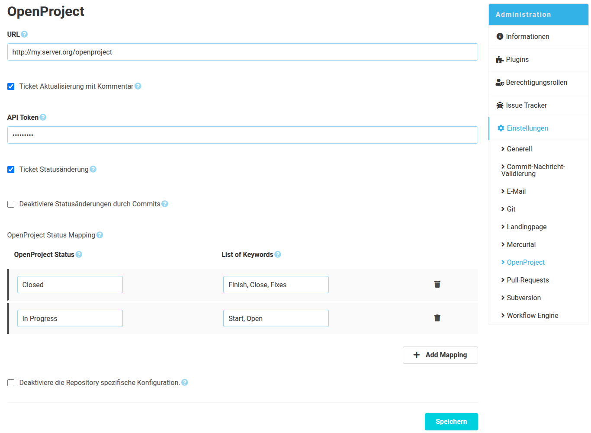

Wie im SCM-Manager üblich, gibt es eine globale und eine repository-spezifische Konfiguration für das OpenProject-Plugin. Die globale Konfiguration gilt für alle Repositories, die keine spezifische Konfiguration hinterlegt haben. Inhaltlich unterscheiden sich die Konfigurationen lediglich darin, dass in der globalen Konfiguration die repository-spezifische Konfiguration deaktiviert werden kann. 

### Konfigurationsformular
Für die Kommunikation zwischen dem SCM-Manager und OpenProject muss zunächst zwingend die OpenProject Instanz-URL inklusive Kontextpfad eingetragen werden.
Anschließend lässt sich bereits konfigurieren in welcher Form OpenProject Tickets verändert / ergänzt werden sollen.

#### Kommentare erzeugen
Um Kommentare in OpenProject zu erzeugen, werden Zugangsdaten benötigt, welche einem technischen OpenProject-Konto gehören sollten.
Dieses Konto benötigt zudem ausreichende Berechtigungen, um Kommentare an existierenden Tickets zu erstellen ("Tickets anzeigen" & "Kommentare hinzufügen").
Des Weiteren muss die REST-Schnittstelle von OpenProject aktiviert sein, die Einstellung befindet sich in OpenProject unter
`Administration → API und Webhooks → Schnittstelle (API) → REST-Schnittstelle aktivieren`.

Die Kommentare werden am OpenProject-Ticket erzeugt, sobald innerhalb einer Commitnachricht die Ticket-ID erwähnt wurde. 

Beispiel Commitnachricht: "#492 Add awesome new feature"

Damit wird ein Kommentar mit dieser Commitnachricht am OpenProject-Ticket 492 erzeugt.

> **Wichtig:** Das konfigurierte OpenProject-Konto benötigt Berechtigungen, um den Status von Tickets zu ändern ("Tickets bearbeiten").
> 
> Zudem sollte nicht mehr als ein OpenProject-Schlüsselwort im Kommentar genannt werden, da das zu unerwünschten Nebeneffekten 
> führen könnte.

#### Ticket-Statusaktualisierung
Um den Status eines Tickets über die Nachricht eines Commits zu ändern, kann eine Ticket-ID mit einem 
OpenProject-Status innerhalb eines Satzes verwendet werden.

Beispiel-Commitnachricht: "Bug #42 closed"

Das Beispiel setzt den Status des Tickets 42 auf "Closed".
Das setzt natürlich voraus, dass es den Status "Closed" in der angegebenen OpenProject-Instanz gibt.

Über die "Status-Modifizierungswörter" lassen sich Wörter definieren, die anstelle des OpenProject-Status verwendet werden können.
Diese Schlüsselwörter kann man in Form einer kommaseparierten Liste angegeben.
Zum Beispiel könnte man für den Status "Closed" folgende Schlüsselwörter angeben: "closes, closing".
Damit würde die Commitnachricht "Closes Bug #42" ebenfalls das Ticket 42 auf den Status "Closed" setzen.

Wenn Statusübergänge nur aufgrund von Pull-Requests und nicht aufgrund von Commits durchgeführt werden sollen, kann
zusätzlich die Option "Deaktiviere Statusänderungen durch Commits" aktiviert werden.

