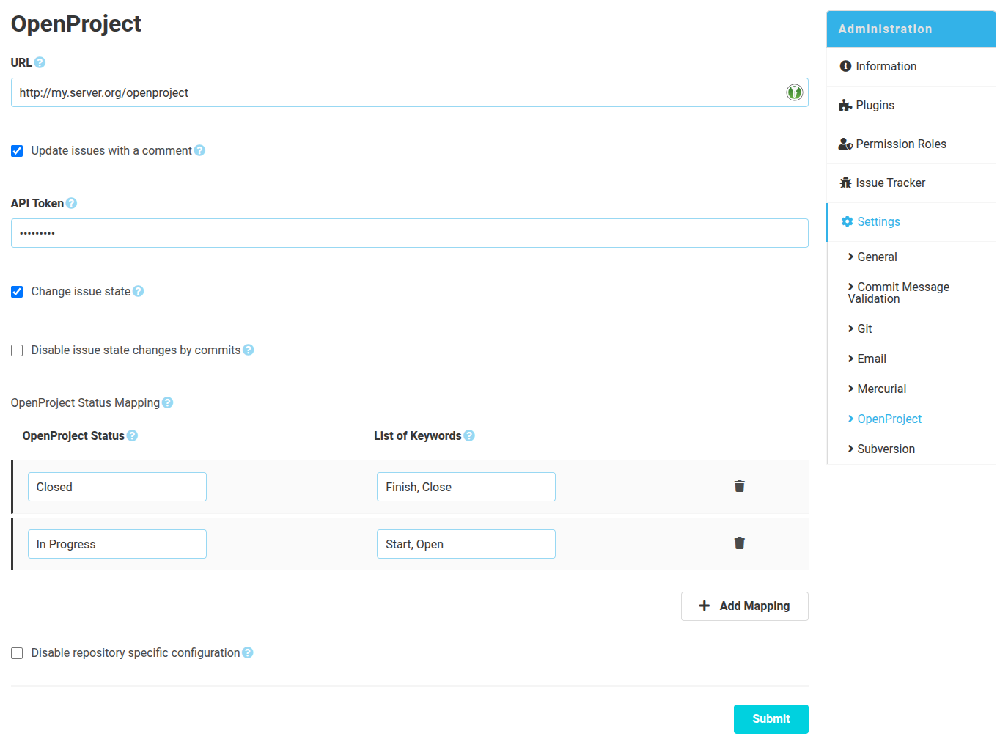

The SCM-OpenProject-Plugin can be configured globally and repository specific. The global configuration is used for all 
repositories that don't have a specific config. The repository specific configuration can be disabled in the global config.

### Configuration form
To connect SCM-Manager with OpenProject, an instance URL including the context path is required.
Afterwards, you can already configure how the OpenProject issues are modified or updated. 

#### Create comments
To create comments in OpenProject, credentials are mandatory. They should belong to a technical OpenProject user.
This user also needs sufficient permissions to add comments to existing issues ("View issues" & "Add notes").
Furthermore, the REST interface of OpenProject must be activated. The setting is located in OpenProject under
`Administration → API and webhooks → API → Enable REST web service`.

Comments are generated on the OpenProject issue if the issue id is mentioned within a commit message. 

Example commit message: "#492 Add awesome new feature".

This will create a comment with this commit message on OpenProject issue 492.

#### Update issue status
To change the status of an issue via a commit message, an issue id and a OpenProject status must be in one sentence.

Example commit message: "Bug #42 closed".

The example sets the status of issue 42 to "Closed".
Of course, this assumes that the status "Closed" exists in the specified OpenProject instance.

> **Important:** The configured openproject user needs permissions to change the status of issues ("Edit issues").
> 
> Furthermore, please avoid to use more than one mapped keyword in one comment as this can cause undesired side effects.

Using the "OpenProject status mapping", you can define keywords that can be used instead of the OpenProject status.
These keywords can be specified in the form of a comma-separated list.
For example, for the status "Closed" you could specify the following keywords: "closes, closing".
The commit message "Closes Bug #42" would then also set the ticket 42 to the status "Closed".

If the status should only be updated due to pull requests and not by commits, the additional option "Disable issue
state changes by commits" can be selected.

